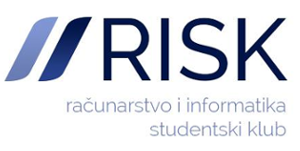
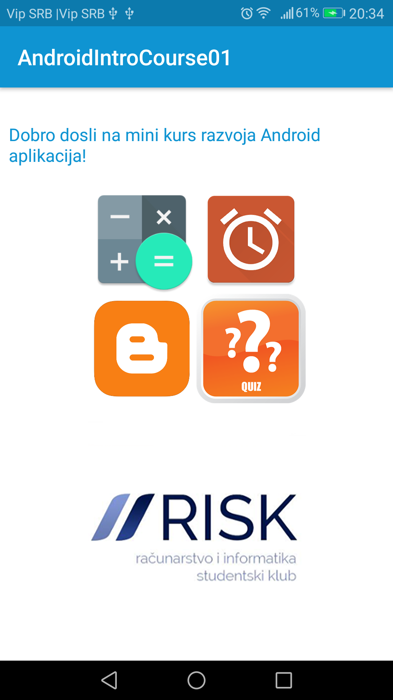
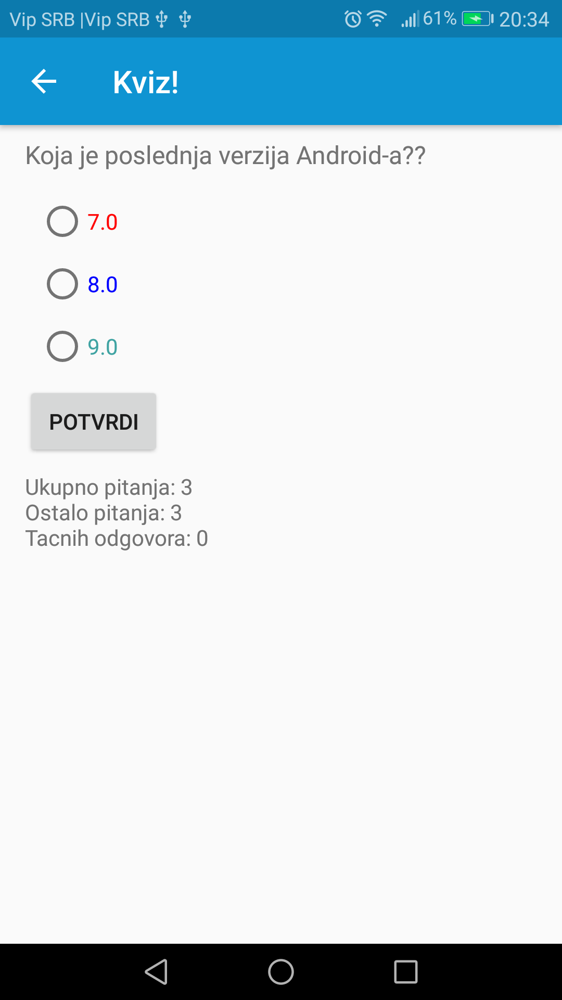

# Mini kurs razvoja Android aplikacija

## O mini kursu

Na Matematičkom fakultetu 5. novembra održan je prvi deo mini kursa posvećen Android programiranju u okviru organizacije RISK.
Kurs je držao kolega [Nemanja Mićović](http://poincare.matf.bg.ac.rs/~nemanja_micovic/) i za cilj je imao da studente upozna
sa razvojem aplikacija za sistem Android.

Više o organizaciji RISK možete pronaći [ovde](http://risk.matf.bg.ac.rs/).

## O aplikaciji
U okviru mini kursa, razvijana je aplikacija koja u sebi sadrži 4 mini programa:
- Kviz
- Digitron
- Tajmer
- Blog

Programi su izabrani kako bi studente uveli kroz Android klase, bitne datoteke, i tehnike kao što su:
- Activity
- Android manifest datoteka
- Toast
- Log
- Stringovni resursi
- CountDownTimer
- GridLayout, ConstraintLayout, xml layout datoteke
- ListView
- Adapter

## Slika aplikacije
 

## O projektu
Aplikacija je razvijena u alatu Android Studio, verzija 2.3.3. Ukoliko imate Android Studio 3.0.0 mogu postojati
potencijalni problemi pri učitavanju projekta. Pogledati zvaničnu dokumentaciju o migriranju na 3.0.0 [ovde](https://developer.android.com/studio/build/gradle-plugin-3-0-0-migration.html).
